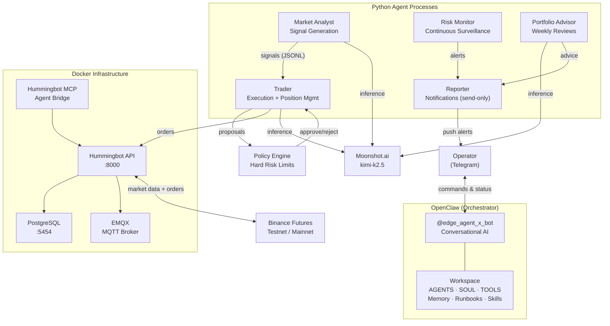
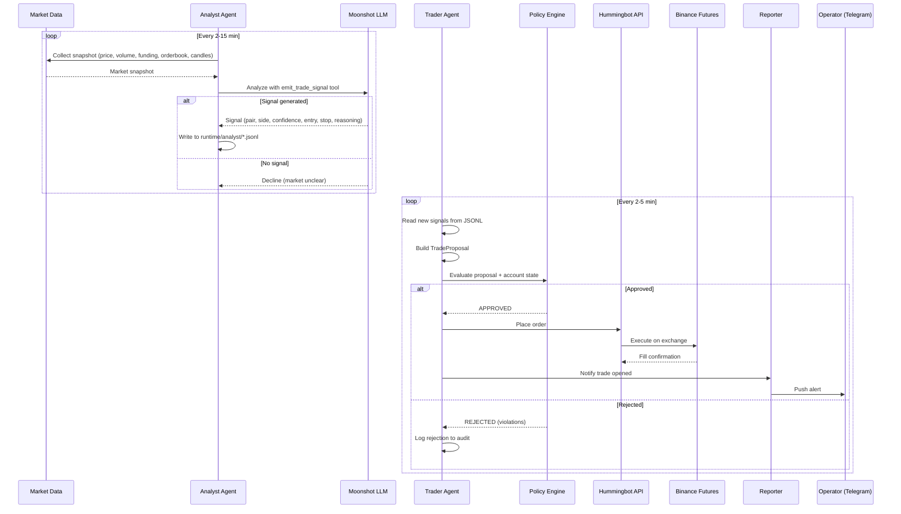
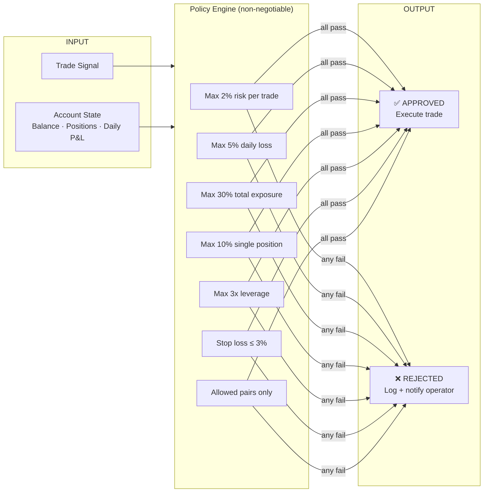
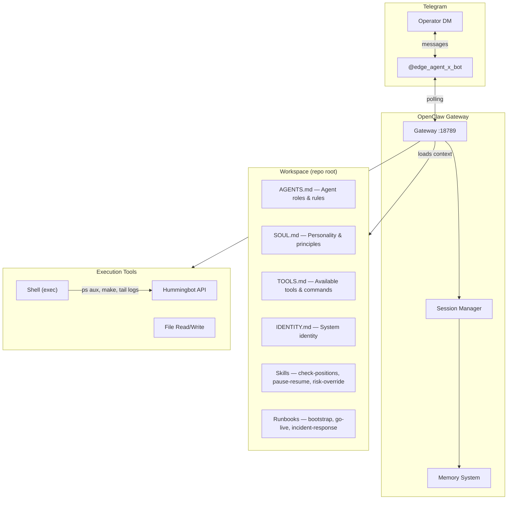
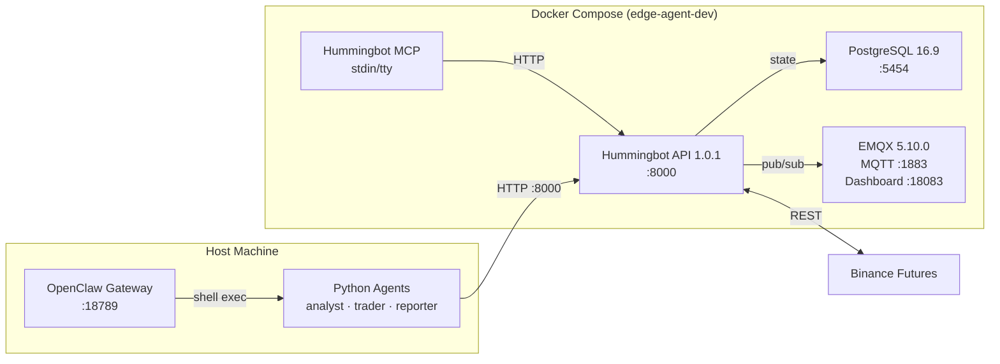

# EDGE-AGENT

Semi-autonomous crypto day trading agent for Binance Futures perpetuals. Uses AI agents to find high-conviction long and short opportunities, execute within hard risk limits, and report via Telegram.

## Status

| Phase | Description | Status |
|---|---|---|
| 1.0 | Repo skeleton | Done |
| 1.1 | Docker infrastructure | Done |
| 1.2 | Smoke tests | Done |
| 1.3 | Binance testnet connection | Done |
| 1.4 | First trade pipeline | Done |
| 2.0 | Market analyst agent | Done |
| 2.1 | Trader agent | Done |
| 2.2 | Risk policy layer | Done |
| 2.3 | Telegram notifications & approvals | Done |
| 2.3b | OpenClaw workspace | Done |
| 2.5 | Generalize to day trading (long + short) | Done |
| 3.2 | Signal quality iteration tools | Done |
| 4.0 | Altcoin opportunity scanner | Done |
| 4.1 | Portfolio Advisor + Risk Monitor agents | Done |
| 4.2 | VPS deployment infrastructure | Done |
| 2.4 | Testnet integration (24-48h run) | Ready |
| 3.0 | Go live (real Binance) | Prepared |

See `tasks/` for detailed PRDs per phase.

## Architecture

### System overview



### Signal-to-trade pipeline



### Risk policy enforcement



### OpenClaw orchestration



### Docker infrastructure



## Agents

| Agent | Role | Trigger | LLM | Writes |
|---|---|---|---|---|
| **Market Analyst** | Signal generation from market data | Every 2-15 min | Moonshot | `runtime/analyst/*.jsonl` |
| **Trader** | Execute signals, manage positions | Every 2-5 min | Moonshot | Orders via Hummingbot API |
| **Reporter** | Push Telegram notifications (send-only) | Event-driven + scheduled | None | Telegram messages |
| **Risk Monitor** | Continuous surveillance, alerting | Every 2 min | None | Alerts to Reporter |
| **Portfolio Advisor** | Weekly portfolio reviews | Weekly | Moonshot | Advice to Reporter |
| **Altcoin Scanner** | Rank perp pairs by opportunity | On-demand | None | Stdout rankings |

### Risk rules (non-negotiable, human-set)

| Rule | Value |
|---|---|
| Max risk per trade | 2% of equity |
| Max daily loss | 5% of equity |
| Max total exposure | 30% of equity |
| Max single position | 10% of equity |
| Max leverage | 3x |
| Stop loss per position | 3% of entry |
| Allowed pairs | BTC-USDT, ETH-USDT |
| Allowed sides | long, short |

Config: `configs/risk/policy.yml`. Reloads on change, no restart needed.

## Repository layout

```text
EDGE-AGENT/
├── src/
│   ├── agents/
│   │   ├── analyst/        # Market analysis + signal generation
│   │   ├── trader/         # Trade execution + position management
│   │   ├── reporter/       # Telegram notifications (send-only, no polling)
│   │   ├── advisor/        # Portfolio advisor (Moonshot-backed)
│   │   ├── risk_monitor/   # Continuous risk surveillance
│   │   └── scanner/        # Altcoin opportunity scanner
│   ├── clients/            # Typed Hummingbot API wrappers
│   ├── policy/             # Risk engine, rules, audit logging
│   ├── shared/             # Config, models, Moonshot client
│   └── strategies/         # Hummingbot V2 controllers
├── tools/                  # Signal export, metrics, journal tools
├── configs/risk/           # policy.yml, altcoins.yml, live-conservative.yml
├── docs/
│   ├── runbooks/           # Operational guides
│   └── decisions/          # Architecture decision records
├── infra/
│   ├── compose/            # Docker Compose (dev + prod)
│   ├── env/                # .env.example templates
│   ├── scripts/            # up, down, smoke, deploy, backup, health
│   └── Dockerfile          # Agent container for production
├── openclaw/
│   ├── workspace/          # Source of truth for OpenClaw workspace files
│   └── sync/               # Sync script to ~/.openclaw/workspace
├── AGENTS.md               # OpenClaw agent definitions (copied from openclaw/workspace/)
├── SOUL.md                 # OpenClaw personality
├── TOOLS.md                # OpenClaw tools reference
├── IDENTITY.md             # OpenClaw system identity
├── USER.md                 # Operator profile
├── tasks/                  # Phase PRDs
├── tests/
│   ├── unit/               # 87 tests
│   └── integration/
└── runtime/                # Gitignored: bot state, logs, audit
```

## Quick start

```bash
# 1. Clone and set up Python
git clone <repo-url> EDGE-AGENT && cd EDGE-AGENT
python3 -m venv .venv && source .venv/bin/activate
pip install -e .

# 2. Configure credentials
cp .env.example .env
# Edit .env with Binance testnet keys, Moonshot API key, Telegram bot token

# 3. Start infrastructure
make up      # Docker: Postgres, EMQX, Hummingbot API, MCP
make smoke   # Verify health

# 4. Add Binance credentials to Hummingbot API
curl -X POST http://localhost:8000/accounts/add-credential/master_account/binance_perpetual_testnet \
  -u admin:<password-from-api.env> \
  -H 'Content-Type: application/json' \
  -d '{"binance_perpetual_testnet_api_key":"<key>","binance_perpetual_testnet_api_secret":"<secret>"}'

# 5. Run tests
make test

# 6. Start trading agents
make integration-test   # Starts analyst + trader + reporter continuously
```

### OpenClaw setup

```bash
# Install OpenClaw (requires Node >= 22)
npm install -g openclaw

# Configure Telegram bot token and workspace in ~/.openclaw/openclaw.json
# Sync workspace files
./openclaw/sync/sync_to_home.sh

# Verify
openclaw status
openclaw channels status --probe
```

## Make targets

### Core operations
| Target | Description |
|---|---|
| `make up` | Start Docker infrastructure |
| `make down` | Stop infrastructure |
| `make logs` | Tail infrastructure logs |
| `make smoke` | Verify infrastructure health |
| `make test` | Run Python test suite (87 tests) |

### Agent operations
| Target | Description |
|---|---|
| `make analyst-once` | Run one market analysis cycle |
| `make trader-once` | Run one trader cycle |
| `make reporter` | Start Telegram reporter (send-only) |
| `make advisor-once` | Run one portfolio advisory review |
| `make risk-monitor` | Start continuous risk surveillance |
| `make scan-altcoins` | Scan and rank altcoin opportunities |
| `make integration-test` | Run all agents continuously on testnet |
| `make integration-test-short` | Quick 2-cycle sanity check (~5 min) |

### Signal analysis
| Target | Description |
|---|---|
| `make signal-export` | Export signals to CSV |
| `make signal-metrics` | Compute signal quality metrics |
| `make signal-journal` | Full pipeline + OpenClaw journal update |

### VPS deployment
| Target | Description |
|---|---|
| `make deploy VPS=user@host` | Deploy to remote VPS |
| `make rollback VPS=user@host` | Rollback to previous version |
| `make backup VPS=user@host` | Download configs and state |
| `make health VPS=user@host` | Check remote system health |

## Infrastructure

### Development
Docker Compose stack (`infra/compose/docker-compose.dev.yml`):
- **PostgreSQL 16.9** — Hummingbot API state
- **EMQX 5.10.0** — MQTT broker for bot communication
- **Hummingbot API 1.0.1** — FastAPI execution layer
- **Hummingbot MCP** — Agent-to-exchange bridge

### Production
`infra/compose/docker-compose.prod.yml` adds restart policies, memory limits, log rotation, and an agent container.

## Documentation

| Location | Content |
|---|---|
| `docs/runbooks/` | integration-test, go-live, disable-trading, rollback, vps-setup |
| `docs/decisions/` | ADR-0001 compose-not-fork, ADR-0002 risk-gateway, ADR-0003 generalist-day-trading |
| `openclaw/workspace/` | Agent definitions, memory, runbooks, skills |
| `tasks/` | Phase PRDs with detailed requirements |

## Stack

- **Python 3.11+** — primary language
- **Hummingbot API** — exchange execution layer
- **Moonshot.ai (kimi-k2.5)** — LLM inference (analyst, trader, advisor)
- **OpenClaw** — AI orchestrator, Telegram interface, memory, sessions
- **Telegram** — operator notifications and conversational control
- **Docker Compose** — dev and production infrastructure
- **PostgreSQL + EMQX** — Hummingbot state and messaging

## Security

This is a **public open-source repository**. See `AGENTS.md` for full security rules.

- Never commit secrets, API keys, or tokens
- Only `.env.example` with placeholders in git
- All credentials via environment variables and gitignored `.env` files
- `runtime/` is gitignored (state, logs, audit)
- Binance mainnet geo-blocked; candles sourced from OKX perpetual
- Policy layer enforces hard limits — no AI override possible
- OpenClaw Telegram access controlled via allowlist (user IDs)
- Reporter runs in send-only mode (no polling conflict with OpenClaw)
